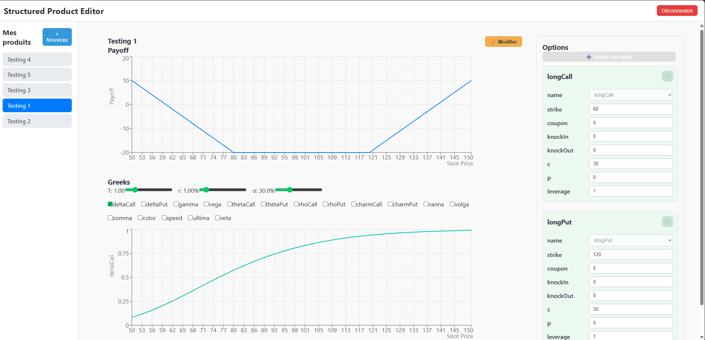

# 🧮 Structured Product Visualizer

A web-based tool to **create**, **edit**, and **visualize structured financial products** in real time.  
Built with **React + TypeScript + Firebase + Recharts**, this app is perfect for financial engineers, traders, students, or anyone interested in exotic options and custom payoffs.

---

## ✨ Features

- 📌 **Structured Product Builder**  
  Create custom products with multiple options (calls, puts, barriers, knock-ins, knock-outs, digitals...).

- ⚙️ **Live Editing & Auto-Save**  
  Update parameters and auto-save with visual confirmation. Each option is editable individually.

- 📈 **Real-Time Graphs**  
  See the final **payoff graph** and toggle different **Greek curves** (Delta, Gamma, Vega, etc.).

- 🔐 **User Authentication**  
  Firebase-authenticated users can securely store and retrieve their own products.

- 📁 **Dynamic Option Library**  
  Option types are fetched from Firestore, so you can expand your model easily without code changes.

---

## 📸 Preview

---

## 🚀 Tech Stack

- **Frontend**: React, TypeScript
- **Graphs**: Recharts
- **Database**: Firebase Firestore
- **Auth**: Firebase Auth
- **Hosting**: GitHub Pages
- **Build Tool**: Parcel

---

